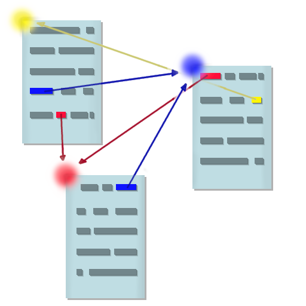
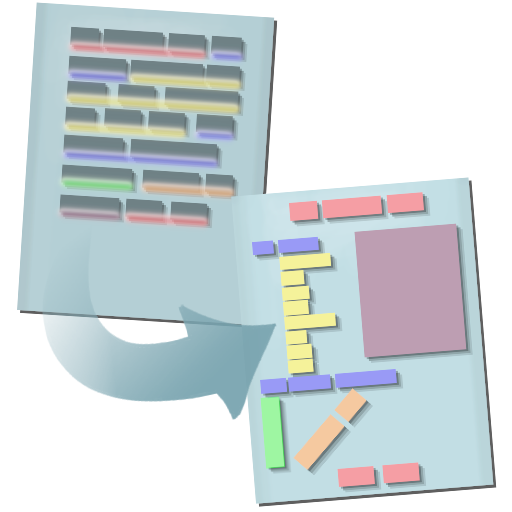

## Was ist Hypertext Markup Language?

>### In aller Kürze:
>* Erfunden um Dokumente im Web darzustellen.
>* Hypertext ist Text der direkt auf weiteren Text verweist.
>* Markup ist das kodierte Zuweisen des Textes zu einem Kontext.

>## Wer hat's erfunden?
>Das World Wide Web begann als das im Jahr 1989 initiierte ENQIRE-Projekt von CERN (Conseil Européen pour la Recherche Nucléaire), dass ein schnelles Übermitteln von Informationen zwischen Wissenschaftlern ermöglichen sollte.
>
>Hand in Hand ging damit eine formale Sprache mit der also wissenschaftliche Dokumente dargestellt werden konnten, und so entstand HTML. Zwar beginnt die veröffentlichte Version der Markup Language erst 1995, jedoch wurde bereits im selben Jahr in dem auch der erste Webserver lief, also 1991, intern mit HTML gearbeitet.

>## Hypertext?
>Ein Grundprinzip des World Wide Webs ist die Vernetzung verschiedenster Webseiten durch Referenzverknüpfungen. Hypertext bedeutet nicht viel mehr als dass der zu lesende Text direkt mit einem anderen Text verknüpft werden kann.
> 

>## Markup Language?
>Um digitalem Text auch leichter leserliche Formen zu geben, muss die Möglichkeit geboten werden Textanteile zu gliedern. Genau dies ist die Idee einer Markup Sprache. Durch Markierungen im Text ermöglicht Markup es rohe Informationen in ihre zugewiesene "Rolle" zu bringen.
> 

>### Sonstiges
>* HTML ist KEINE Programmiersprache.
>* Die Form des Textes ist die eigentliche Aufgabe von HTML, auch wenn begrenzt Darstellung und Funktion von Text dadurch bestimmt werden kann.
>* Derzeit wird HTML5 verwendet.
>* XML (Extensible Markup Language) wurde erst 7 Jahre nach HTML im Jahr 1998 veröffentlicht.
>* Neben Webseiten, die allermeist HTML verwenden, sind Markup Sprachen auch in anderen Kontexten nützlich:
>1. **Markdown**  
zum schnelles Erstellen von Dokumenten
>2. **CSV, XML** und **JSON**  
für persistente Datenspeicherung
>3. **LaTeX**  
für naturwissenschaftliche Dissertationen

>### Links zum Thema:
>* [Die erste Webseite](https://www.w3.org/History/19921103-hypertext/hypertext/WWW/TheProject.html)  
>* [Originaldokumentation der ersten HTML Version (1991)](https://www.w3.org/History/19921103-hypertext/hypertext/WWW/MarkUp/Tags.html)
>* [Der Erfinder des Webs](https://en.wikipedia.org/wiki/Tim_Berners-Lee)